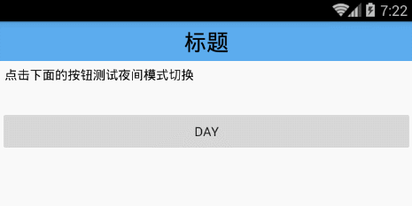
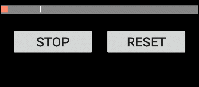
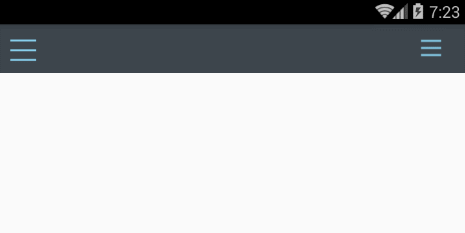

###AndroidDemo
该项目主要用于记录知识点的demo。入口为`MainActivity`，所有的知识点demo都在listview里面，点击对应的item进入该知识点的demo。
每增加一个知识点，就在listview插入一条数据（还需要在AndroidManifest.xml注册activity）作为入口。
目前已有的demo：
- [CameraActivity](./md/CameraActivity.md)
- [DayNightActivity](./md/DayNightActivity.md)

- [MarkableProgressBarActivity](./md/MarkableProgressBarActivity.md)

- [TranslucentStatusBarActivity](./md/TranslucentStatusBarActivity.md)
- [TabLayoutActivity](./md/TabLayoutActivity.md)
- [BannerViewActivity](./md/BannerViewActivity.md)
- [DrawerArrowActivity](./md/DrawerArrowActivity.md)

- [PraiseViewActivity](./md/PraiseViewActivity.md)
- [ScrollingImageActivity](./md/ScrollingImageActivity.md)
- [DialogFragmentActivity](./md/DialogFragmentActivity.md)
